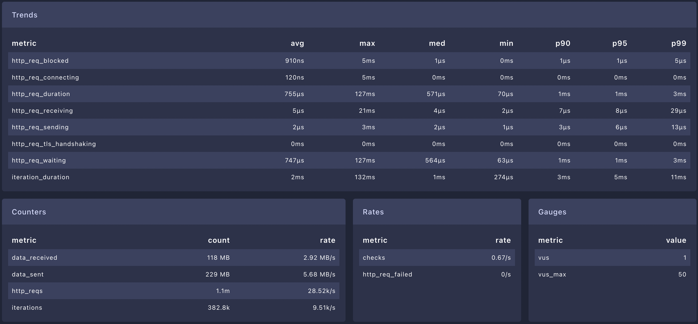
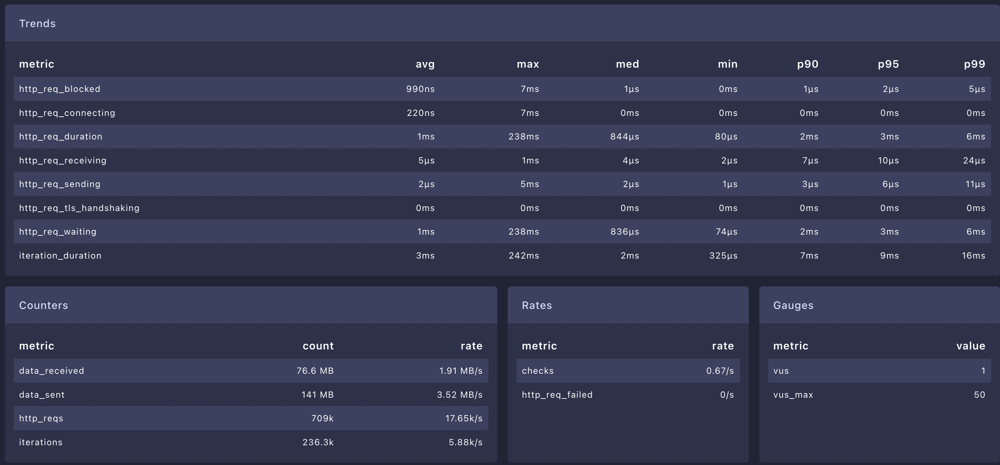
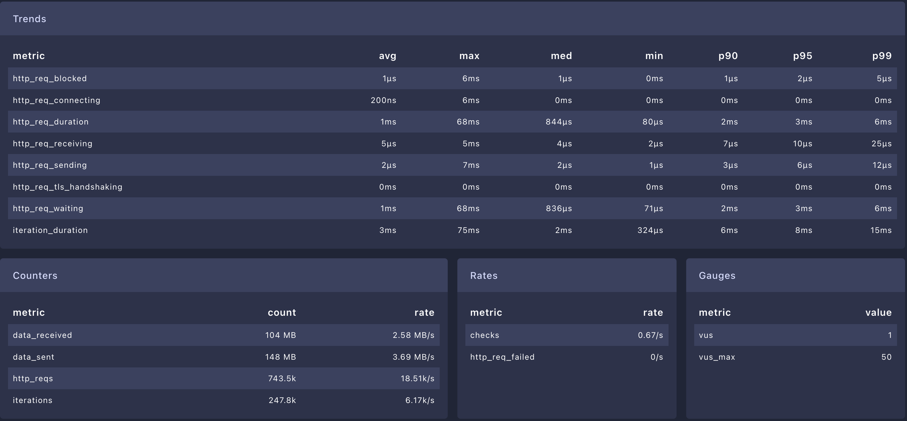
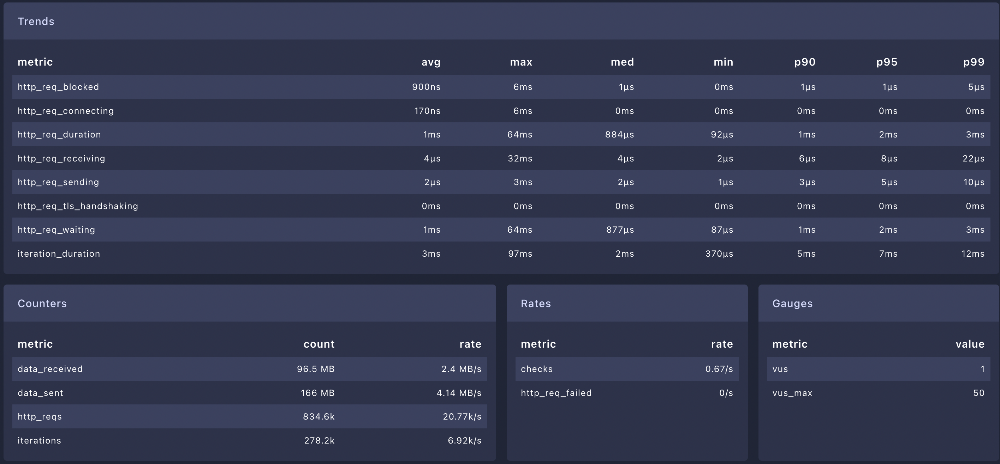
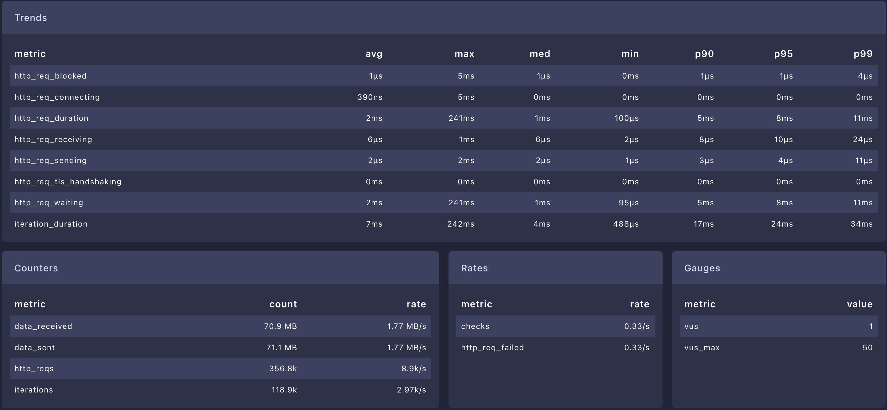
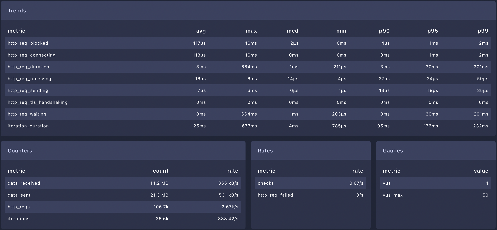
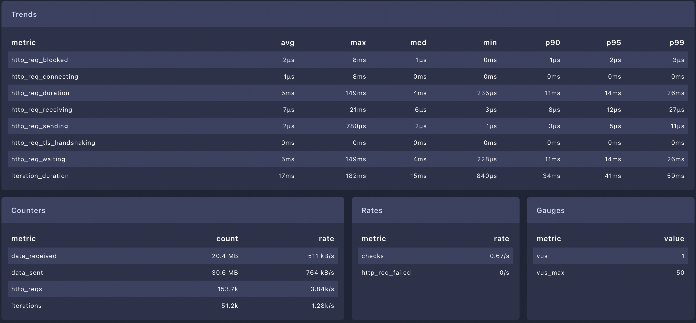
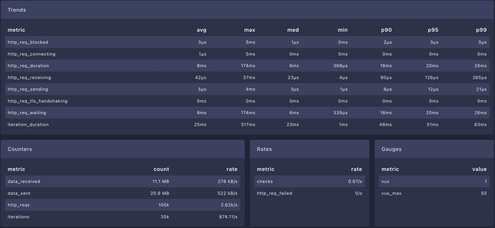
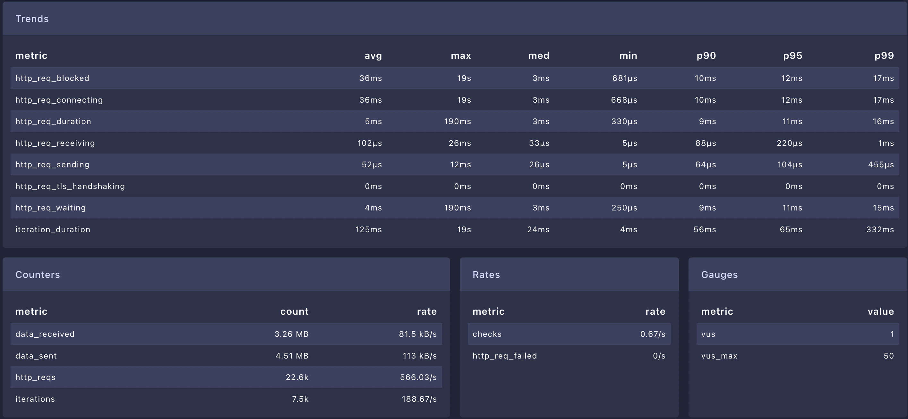

# bapi

This is a project to test benchmarking for different language/frameworks.

The swagger definition is [here](swagger-3.yaml).

You can run api tests with `pytest api_test.py`, here we have http request to localhost validation http status and response bodies.

---

To run benchmark we use the [k6 script](bench/bench.js). To get a dashboard locally you can use [kibana xk6](https://github.com/grafana/xk6).

```terminal
go install go.k6.io/xk6/cmd/xk6@latest
xk6 build --with github.com/grafana/xk6-dashboard@latest
./k6 run --out dashboard bench/bench.js
```

## Benchmark

- Rust



- Go - Gin



- Go - Mux



- Deno



- Node - Fastify



- Ruby - Sinatra



- Python - Flask



- Python - Fastapi



- Python - Falcon


