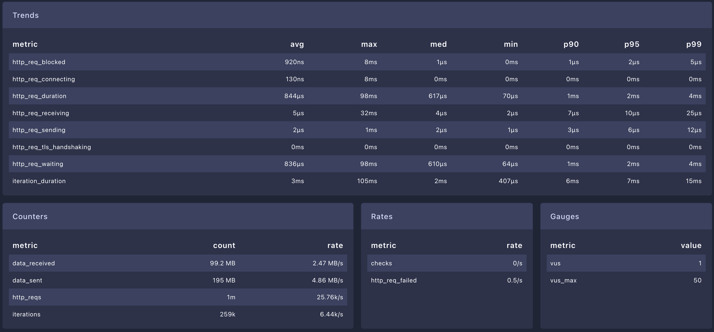

# bapi

A benchmarking project comparing performance across different programming languages and frameworks.

## Documentation

The API specification is available in the [swagger definition file](swagger-3.yaml).

## Testing

API tests can be run using:

```bash
pytest api_test.py
```

These tests validate HTTP status codes and response bodies by making requests to localhost.

## Benchmarking

We use [k6](https://k6.io/) for performance testing. For local dashboard visualization, we recommend using [k6 dashboard](https://github.com/grafana/xk6).

To set up and run the benchmark with dashboard:

```bash
# Install xk6
go install go.k6.io/xk6/cmd/xk6@latest

# Build k6 with dashboard extension
xk6 build --with github.com/grafana/xk6-dashboard@latest

# Run benchmark with dashboard output
./k6 run --out dashboard bench/bench.js
```

## Benchmark Results

Below are the performance results for each implementation:

- Rust


- Go - Native



- Go - Gin


- Go - Mux


- Deno


- Node - Fastify


- Ruby - Sinatra


- Python - Flask


- Python - Fastapi


- Python - Falcon


